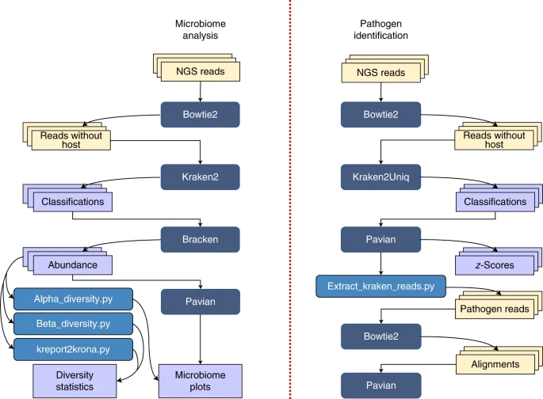

According to protocol paper for Kraken 2, Bracken, KrakenUniq, and KrakenTools (published Sept 28, 2022): "Metagenome analysis using the Kraken software suite"

- `Kraken`: classify microbiome samples

-  `Bracken` : estimate abundance of microbiome samples
  (Bayesian Reestimation of Abundance with KrakEN) is a highly accurate statistical method that computes the abundance of species in DNA sequences from a metagenomics sample.

## Terminology
- $\alpha$-diversity: a measure defined by Whittaker [^whittaker] captures the average diversity within a particular ecosystem. There are different $\alpha$-diversity values that approximate the average diversity by computing a sort of weighted average for species counts in a sample. [^protocol]
- $\beta$-diversity is useful when trying to examine the change in species diversity between two or more ecosystems. [^protocol]

[^Bracken]:https://github.com/jenniferlu717/Bracken
[^protocol]:https://www.nature.com/articles/s41596-022-00738-y
[^whittaker]:https://onlinelibrary.wiley.com/doi/abs/10.2307/1218190