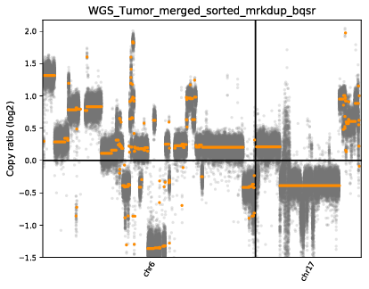

It is easy to find a pipeline and call for results. However, how do you confirm the results are valid? One of the good approaches is to reproduce tutorials.

## Goal

This [^tutorial] uses human genome to identify CNV using cnvkit [^cnvkit]. We will reproduce the tutorial's analysis by downloading their raw data, running the analysis, and comparing the results with their provided outcome to better understand the pipeline.

## Download data
```sh
mkdir data
cd data
# Get ref.fa
wget -c http://genomedata.org/pmbio-workshop/references/genome/all/ref_genome.tar
tar -xvf ref_genome.targunzip 
gunzip ref_genome.fa.gz
# Get copyCat bed
wget -c http://genomedata.org/pmbio-workshop/misc/copyCat_annotation.zip
unzip copyCat_annotation.zip 
# Get Exom target bed
wget -c http://genomedata.org/pmbio-workshop/references/exome/SeqCapEZ_Exome_v3.0_Design_Annotation_files.zip	
unzip SeqCapEZ_Exome_v3.0_Design_Annotation_files.zip
# Get bam
wget -r -np -nH --cut-dirs=4 -R "index.html*" http://genomedata.org/pmbio-workshop/results/chr6_and_chr17/align/
# Get wgs bed
wget http://genomedata.org/pmbio-workshop/results/chr6_and_chr17/somatic/cnvkit_wgs/access-excludes.hg38.chr6_and_17.target.bed
# Get results of only chr6 and chr17
cd results
wget -r -np -nH --cut-dirs=4 -R "index.html*" http://genomedata.org/pmbio-workshop/results/chr6_and_chr17/somatic/cnvkit_exome/
# Get results of wgs
wget -r -np -nH --cut-dirs=4 -R "index.html*" http://genomedata.org/pmbio-workshop/results/chr6_and_chr17/somatic/cnvkit_wgs/
```

## Run analysis
### Prepare path
```sh
conda activate py38_cnvkit
export PYTHONPATH=PATH_TO_PYTHON
# Path
cnvkit_path="python -m cnvkit.cnvlib.cnvkit "
WD=WORK_DIR/
input_path=$WD/data
REF=$input_path/ref_genome.fa
copyCat_annotation_bed=$input_path/copyCat_annotation/gaps.bed
output_path=$WD/sandbox

mkdir -p $output_path
```
### Run analysis
```sh
###### Prepare data
# Calculate the regions of the genome which are inaccessible to sequencing
$cnvkit_path access $REF -x $copyCat_annotation_bed -o $output_path/access-excludes.hg38.bed

# cnvkit will complain if access-excludes contains chromosomes not in the bam file
# we subset to chr6 and chr17 here to avoid this error later
grep "chr6\|chr17" $output_path/access-excludes.hg38.bed > $output_path/access-excludes.hg38.chr6_and_17.bed

####### Run analysis
# cnvkit will complain if chromosomes are in the bed file but not the bam, we fix this here
grep "chr6\|chr17" $input_path/SeqCapEZ_Exome_v3.0_Design_Annotation_files/SeqCap_EZ_Exome_v3_hg19_primary_targets.bed > $input_path/SeqCap_EZ_Exome_v3_hg38_primary_targets.v2.chr6_and_17.bed

# run the entire cnvkit workflow for the exome data
$cnvkit_path batch $input_path/Exome_Tumor_sorted_mrkdup_bqsr.bam --normal $input_path/Exome_Norm_sorted_mrkdup_bqsr.bam --targets $input_path/SeqCap_EZ_Exome_v3_hg38_primary_targets.v2.chr6_and_17.bed --fasta $REF --access $output_path/access-excludes.hg38.chr6_and_17.bed --output-reference $output_path/my_reference.cnn --output-dir $output_path --method hybrid -p 8 --diagram --scatter --drop-low-coverage

## Run whole genome seq

# make directory to store results
mkdir -p $output_path/cnvkit_wgs
cd $output_path/cnvkit_wgs
# run the cnvkit pipeline
$cnvkit_path batch $input_path/WGS_Tumor_merged_sorted_mrkdup_bqsr.bam --normal $input_path/WGS_Norm_merged_sorted_mrkdup_bqsr.bam --fasta $REF --access $input_path/access-excludes.hg38.chr6_and_17.target.bed --output-reference $output_path/cnvkit_wgs/my_reference.cnn --output-dir $output_path/cnvkit_wgs --method wgs -p 8 --diagram --scatter
```

## Results

There are files and plots results that we can use to compare. And we successfully replicated the tutorial.




[^tutorial]:https://pmbio.org/module-05-somatic/0005/04/01/Somatic_CNV_Calling/
[^cnvkit]:https://github.com/etal/cnvkit