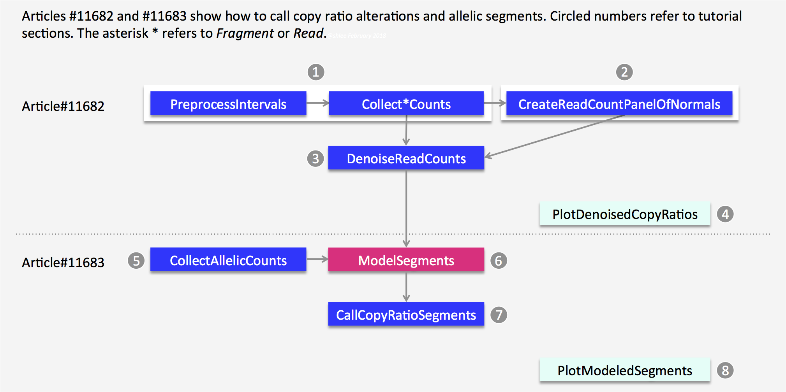

Here is a workflow from GATK:

GATK tutorials:
[Part I](https://gatk.broadinstitute.org/hc/en-us/articles/360035531092)
[Part II](https://gatk.broadinstitute.org/hc/en-us/articles/360035890011)

[Ref in Chinese](https://mp.weixin.qq.com/s/Lvfy7Y352WhLMuzawMvroA)