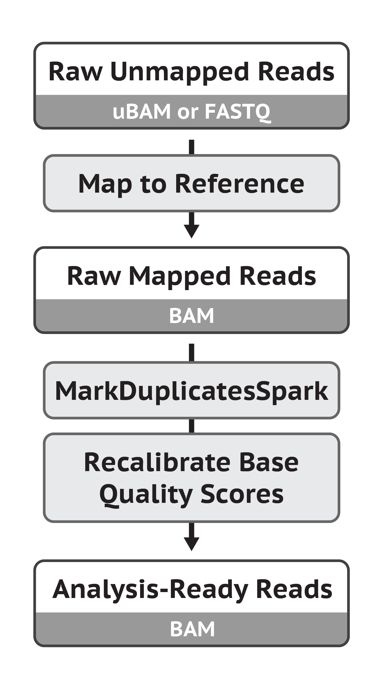

GATK is a Genome Analysis Toolkit. Here are some notes about GATK:
## GATK data pre-processing
[GATK data pre-processing](https://gatk.broadinstitute.org/hc/en-us/articles/360035535912-Data-pre-processing-for-variant-discovery)

Here is a workflow from GATK:


1. Raw Mapped Reads (Bam) -> `MarkDuplicates` 
Check and compare results
```sh
samtools view BEFORE_MARKDUPLICATES.bam | wc -l
samtools view AFTER_MARKDUPLICATES.bam | wc -l
```
2. -> `BaseRecalibrator` + `ApplyBQSR` -> Analysis-Ready Rads (Bam)