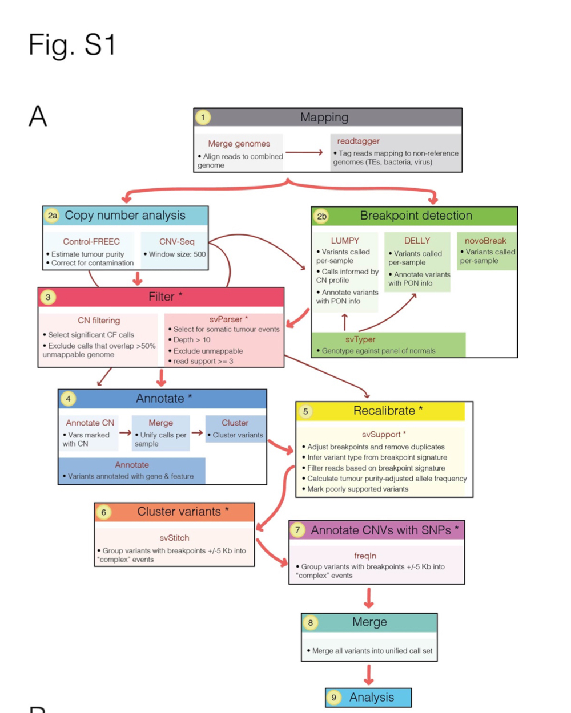

Paper: [Evolution and genomic signatures of spontaneous
somatic mutation in Drosophila intestinal stem cells](https://genome.cshlp.org/content/31/8/1419.full.pdf+html)[^2021Riddiford]

## Definitions
- Tumor: neoplasia
- Normal(control): head correspond to the same fly
Tumor and Normal information <span style="color:blue">*S1* </span>
35 tumor samples with their control
```python
sample_control_pair = {
    'P1': 'P2',
    'P3': 'P4',
    'P5': 'P6',
    'P39': 'P40',
    'P41': 'P42',
    'P43': 'P44',
    'P47': 'P48',
    'P49': 'P50',
    'P51': 'P52',
    'P53': 'P54',
    'P55': 'P56',
    'P57': 'P58',
    'P59': 'P60',
    'P61': 'P62',
    'P63': 'P64',
    'P65': 'P66',
    'P45a': 'P46a',
    'P7': 'P8',
    'P9': 'P10',
    'P11': 'P12',
    'P15': 'P16',
    'P17': 'P18',
    'P19': 'P20',
    'P29': 'P30',
    'P31': 'P32',
    'P33': 'P34',
    'P35': 'P36',
    'P37': 'P38',
    'P23': 'P24',
    'P25': 'P26',
    'P27': 'P28',
    'D1': 'D2',
    'D3': 'D4',
    'D5': 'D6',
    'D7': 'D8',
    }
```
Denote:
1. For three tumor normal pairs (samples P1, P3, and P5), data were reanalyzed from our previous work (Siudeja et al. 2015), and sequencing reads are available under the ArrayExpress (https://www.ebi.ac.uk/
arrayexpress/) accession number E-MTAB-3917.
1. Started with 37 samples, then (P13, P21) were excluded
from further analysis owing to low coverage.

## Workflow
[^2021Riddiford]
[^Data]

## Read tagging
Tool: `readtagger` : tag reads that map to multiple genomes
Steps:
1. Map reads to Drosophila reference TE sequences using BWA-MEM v0.7.15 to annotate non-reference TE sequences in the genomes of our fly stocks.
2. To filter out reads that likely originated from
contaminating species of the Drosophila microbiome, map reads to several known species found in ...
3. Map reads to Drosophila melanogaster genome release 6.12, and readtagger v0.4.11 was used to tag
reads.
4. Duplicate reads were marked using Picard MarkDuplicates v2.7.1

#### Supplementary Materials
<font color=Blue>S1</font>: Paired samples used for somatic mutation analysis
<font color=Blue>S2</font>: Structural variants excluded from analysis after being manually identified (using IGV) as likely false positives  
<font color=Blue>S3</font>: Simulated sequencing reads containing structural variants across the mappable genome 
<font color=Blue>S4</font>: Detection of simulated variants (from Table S3) at different depths and tumour purity
<font color=Blue>S5</font>: Comparison of randomly selected structural variants from the filtered Chakraborty calls with those detected using the Riddiford pipeline
<font color=Blue>S6</font>: Comparision of variants detected by Riddiford pipeline and calls from Chakraborty et al.
<font color=Blue>S7</font>: Structural variants affecting the Notch locus
<font color=Blue>S8</font>: Somatic structural variants throughout the genome
<font color=Blue>S9</font>: Somatic SNV and Indel calls throughout the genome
<font color=Blue>S10</font>: SNP variants between lines called by FreeBayes (germline SNPs)
<font color=Blue>S11</font>:Annotated SNVs and Indels predicted to impact protein sequence


[^2021Riddiford]: Riddiford, N., Siudeja, K., van den Beek, M., Boumard, B., & Bardin, A. J. (2021). Evolution and genomic signatures of spontaneous somatic mutation in Drosophila intestinal stem cells. Genome research, 31(8), 1419–1432. https://doi.org/10.1101/gr.268441.120

[^Data]: NCBI BioProject database with accession number PRJNA641572 https://www.ncbi.nlm.nih.gov/bioproject/?term=PRJNA641572