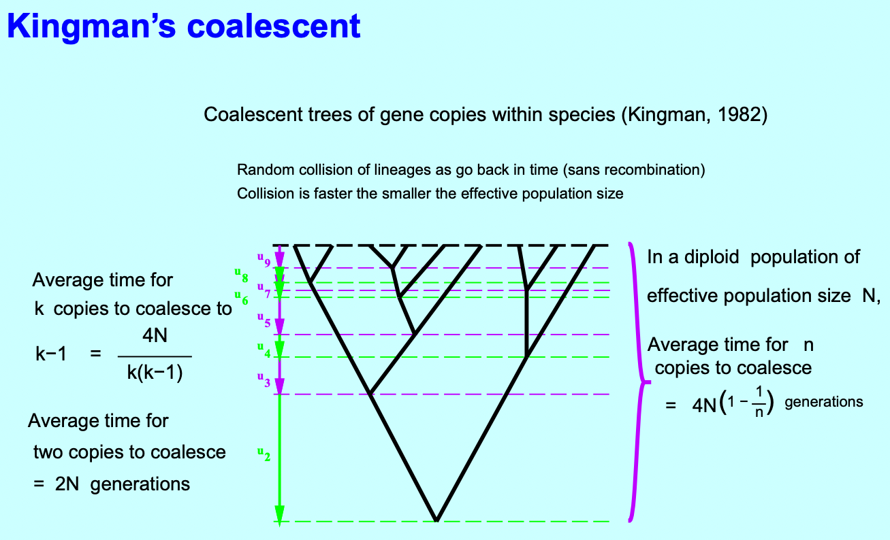

The following materials are from 2016 SISG notes by Felsenstein [^pdf].

Note that coalescence is faster in small populations. It is also crucial to consider migrations among populations, mutation, recombination, and natural selection.  

The estimation of coalescent trees is often inaccurate due to a limited number of available sites, which is typically modest. By looking into the coalescent tree, the population and genetic parameters (population size, mutation rate, migration rate, population growth rate, rate of recombination) can be explored. The idea is to sum up likelihoods over uncertainty about the tree, which can be achieved by using Markov Chain Monte Carlo (MCMC) methods. Softwares such as `LAMARC`, `BEAST`, `MIGRATE`, `IMa` or `BEST` can facilitate the completion of genetic and evolutionary analysis tasks.

[^pdf]:https://evolution.gs.washington.edu/sisg/2016/2016_SISG_19_13.pdf