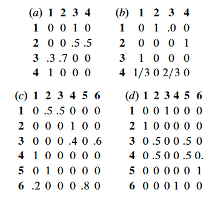
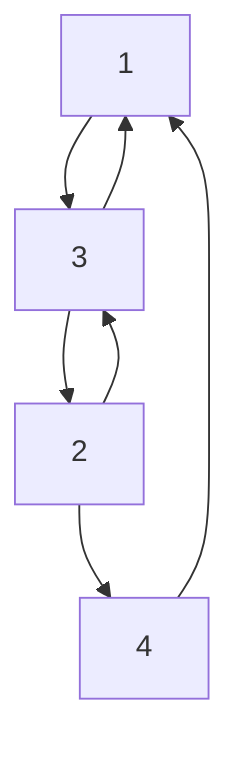
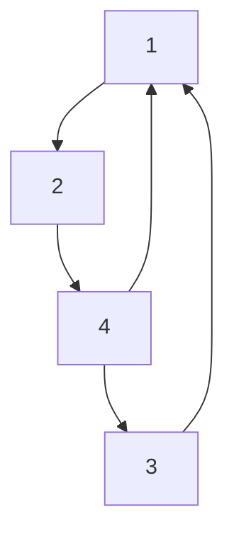
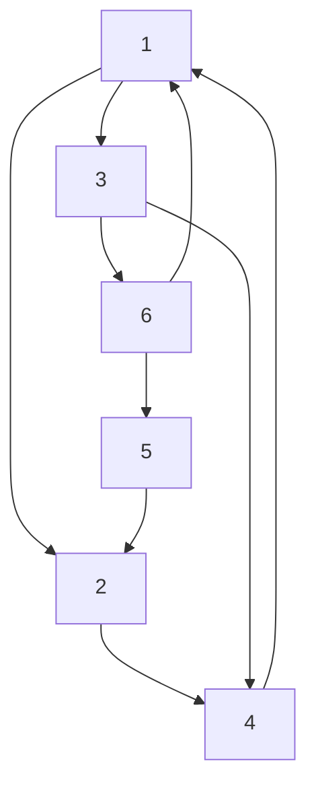
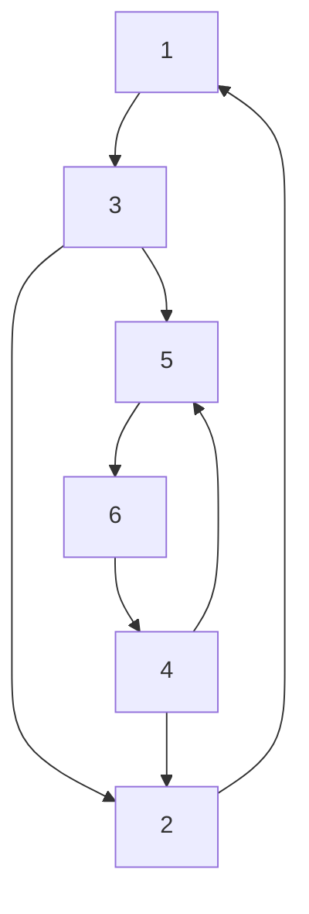

I am going to use fancy mermaid to visualize some transition probability matrix. 
::: tip Exercise 1.14 
Do the following Markov chains converge to equilibrium? [^Textbook]
:::

(a)

(b)

(c)

(d)

[^Textbook]: Essentials of Stochastic Processes (3rd Edition) by Rick Durrett (Springer, 2016)